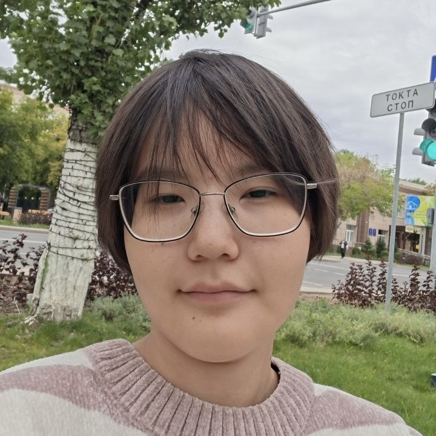
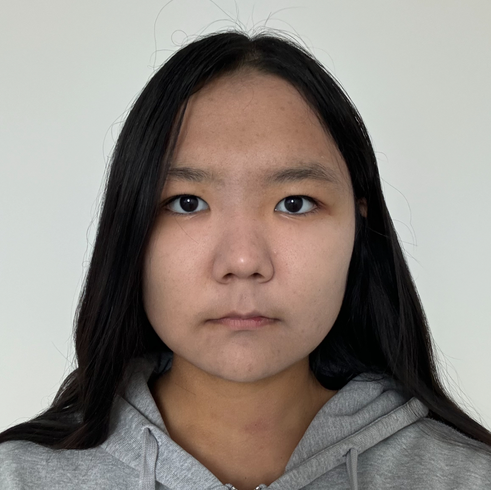

<!DOCTYPE html>
<html lang="en">
<head>
    <meta charset="UTF-8">
    <meta name="viewport" content="width=device-width, initial-scale=1.0">
    <!-- Created by: Kairullina Madina, Ashirbayeva Ayaulym -->
    <title>TilUP | About Us</title>
    <link rel="stylesheet" href="css/style.css">
</head>

<body>

    <header>
        <nav class="navbar">
            <a href="index.html" class="logo">
                
                TilUP
            </a>

            

                <a href="index.html">Home</a>
                <a href="why-learn.html">Why Learn</a>
                <a href="courses.html">Courses</a>
                <a href="tutors.html">Find a Tutor</a>
                <a href="become_tutor.html">Become a Tutor</a>
                <a href="about.html" class="active">About Us</a>
            

            <a href="#" class="login-button">Login</a>
        </nav>
    </header>

    <main>

        <section class="page-hero">
            

                
WHO WE ARE

                <h1>About TilUP</h1>
                
Empowering learners and tutors to connect, learn, and grow across cultures.

            

        </section>

        <!-- Development Team Section: Flexbox Cards -->
        <section class="team-section">
            
DEVELOPMENT TEAM

            <h2>Meet the Developers</h2>
            

                Meet the students behind the TilUP web project, responsible for designing 
                the user experience, HTML structure, and responsive stylesheet styling.
            

            

                <!-- Member 1: Kairullina Madina -->
                <article class="team-card">
                    
                    

                        <h3>Kairullina Madina</h3>
                        Frontend Developer
                        

                            Passionate about UI structuring, responsive design, and CSS layout architecture.
                        

                        

                            <h4>Project Roles:</h4>
                            <ul>
                                <li>Home & About Us layout structuring</li>
                                <li>Semantic HTML5 boilerplate & accessibility</li>
                                <li>Box model & CSS Grid areas design</li>
                            </ul>
                        

                    

                </article>

                <!-- Member 2: Ashirbayeva Ayaulym -->
                <article class="team-card">
                    
                    

                        <h3>Ashirbayeva Ayaulym</h3>
                        Frontend Developer
                        

                            Enthusiastic about interactive web technologies, responsive Flexbox styling, and forms.
                        

                        

                            <h4>Project Roles:</h4>
                            <ul>
                                <li>Find a Tutor & Application Form implementation</li>
                                <li>Interactive tables and form components</li>
                                <li>Flexbox positioning & state pseudo-classes</li>
                            </ul>
                        

                    

                </article>

            

        </section>

    </main>

    <footer>
        
&copy; 2026 TilUP

        
Team Members: Kairullina Madina, Ashirbayeva Ayaulym

    </footer>

</body>
</html>