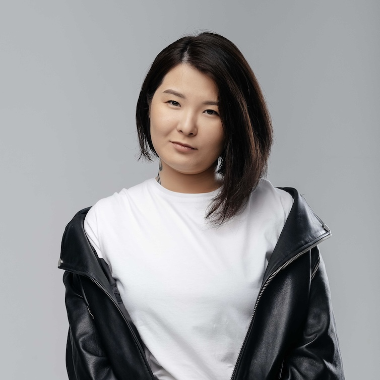
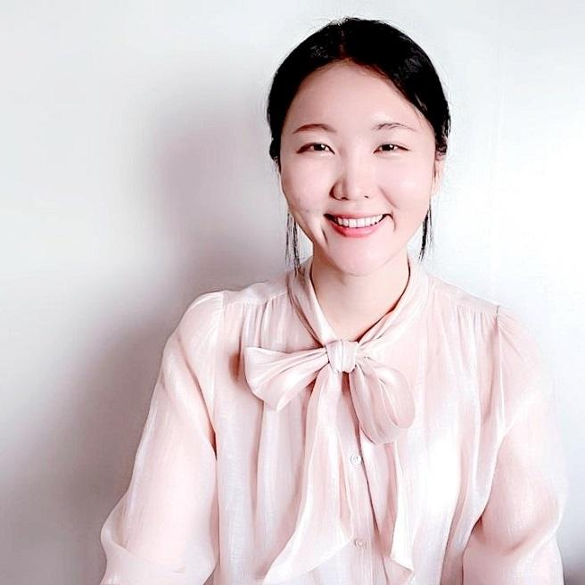

<!DOCTYPE html>
<html lang="en">
<head>
    <meta charset="UTF-8">
    <meta name="viewport" content="width=device-width, initial-scale=1.0">

    <!-- Created by: Kairullina Madina, Ashirbayeva Ayaulym -->

    <title>TilUP | Find a Language Tutor</title>
    <link rel="stylesheet" href="css/style.css">
</head>

<body>

<header>
    <nav class="navbar">
        <a href="index.html" class="logo">
            
            TilUP
        </a>

        

            <a href="index.html">Home</a>
            <a href="why-learn.html">Why Learn</a>
            <a href="courses.html">Courses</a>
            <a href="tutors.html" class="active">Find a Tutor</a>
            <a href="become_tutor.html">Become a Tutor</a>
            <a href="about.html">About Us</a>
        

        <a href="#" class="login-button">Login</a>
    </nav>
</header>

<main>

    <section class="page-hero">
        

            
FIND YOUR LANGUAGE TUTOR

            <h1>Meet Our Tutors</h1>
            
Choose a tutor based on the language you want to learn and your current level.

        

    </section>

    <!-- Filters Section -->
    <section class="filters-section">
        
FILTER TUTORS

        <form class="filters">
            

                <label for="filter-language">
                    <svg width="16" height="16" viewBox="0 0 24 24" fill="none" stroke="currentColor" stroke-width="2"><circle cx="12" cy="12" r="10"></circle><line x1="2" y1="12" x2="22" y2="12"></line><path d="M12 2a15.3 15.3 0 0 1 4 10 15.3 15.3 0 0 1-4 10 15.3 15.3 0 0 1-4-10 15.3 15.3 0 0 1 4-10z"></path></svg>
                    Language
                </label>
                <select id="filter-language" name="language">
                    <option value="">All Languages</option>
                    <option value="kazakh">Kazakh</option>
                    <option value="chinese">Chinese</option>
                    <option value="english">English</option>
                    <option value="korean">Korean</option>
                    <option value="french">French</option>
                    <option value="german">German</option>
                    <option value="spanish">Spanish</option>
                    <option value="japanese">Japanese</option>
                    <option value="arabic">Arabic</option>
                    <option value="russian">Russian</option>
                    <option value="italian">Italian</option>
                    <option value="turkish">Turkish</option>
                </select>
            

            

                <label for="filter-level">
                    <svg width="16" height="16" viewBox="0 0 24 24" fill="none" stroke="currentColor" stroke-width="2"><line x1="18" y1="20" x2="18" y2="10"></line><line x1="12" y1="20" x2="12" y2="4"></line><line x1="6" y1="20" x2="6" y2="14"></line></svg>
                    Level
                </label>
                <select id="filter-level" name="level">
                    <option value="">All Levels</option>
                    <option value="a1-a2">A1–A2 (Beginner)</option>
                    <option value="b1-b2">B1–B2 (Intermediate)</option>
                    <option value="c1-c2">C1–C2 (Advanced)</option>
                </select>
            

            

                <label for="filter-type">
                    <svg width="16" height="16" viewBox="0 0 24 24" fill="none" stroke="currentColor" stroke-width="2"><path d="M4 19.5A2.5 2.5 0 0 1 6.5 17H20"></path><path d="M6.5 2H20v20H6.5A2.5 2.5 0 0 1 4 19.5v-15A2.5 2.5 0 0 1 6.5 2z"></path></svg>
                    Lesson Type
                </label>
                <select id="filter-type" name="type">
                    <option value="">All Lessons</option>
                    <option value="speaking">Speaking Practice</option>
                    <option value="grammar">Grammar & Writing</option>
                    <option value="exam">Exam Preparation (HSK, IELTS, TORFL)</option>
                    <option value="business">Business Language</option>
                </select>
            

        </form>
    </section>

    <!-- Tutors Grid Section (Grid Areas + Flexbox) -->
    <section class="tutors-section">
        

            <!-- 1. Kazakh -->
            <article class="tutor-card">
                
                Kazakh
                <h3 class="tutor-name">Aizhan Kassymova</h3>
                

                    <svg class="star-icon" width="16" height="16" viewBox="0 0 24 24" fill="#F59E0B"><polygon points="12 2 15.09 8.26 22 9.27 17 14.14 18.18 21.02 12 17.77 5.82 21.02 7 14.14 2 9.27 8.91 8.26 12 2"></polygon></svg>
                    5.0 • Native Speaker & Philologist
                

                
Modern Kazakh for everyday life, conversational practice and business communication.

                <ul class="tutor-details">
                    <li>Levels: A1–C1</li>
                    <li>Lesson: Conversational & QAZTEST</li>
                    <li>Hourly Rate: $16</li>
                </ul>
                <a href="#" class="button tutor-btn">Choose Tutor</a>
            </article>

            <!-- 2. Chinese -->
            <article class="tutor-card">
                
                Chinese
                <h3 class="tutor-name">Li Wei</h3>
                

                    <svg class="star-icon" width="16" height="16" viewBox="0 0 24 24" fill="#F59E0B"><polygon points="12 2 15.09 8.26 22 9.27 17 14.14 18.18 21.02 12 17.77 5.82 21.02 7 14.14 2 9.27 8.91 8.26 12 2"></polygon></svg>
                    4.9 • Certified HSK Trainer
                

                
Mandarin pronunciation, pinyin, Chinese characters and intensive HSK 1–6 preparation.

                <ul class="tutor-details">
                    <li>Levels: Beginner – HSK 6</li>
                    <li>Lesson: HSK Exam & Speaking</li>
                    <li>Hourly Rate: $22</li>
                </ul>
                <a href="#" class="button tutor-btn">Choose Tutor</a>
            </article>

            <!-- 3. English -->
            <article class="tutor-card">
                
                English
                <h3 class="tutor-name">Emily Brown</h3>
                

                    <svg class="star-icon" width="16" height="16" viewBox="0 0 24 24" fill="#F59E0B"><polygon points="12 2 15.09 8.26 22 9.27 17 14.14 18.18 21.02 12 17.77 5.82 21.02 7 14.14 2 9.27 8.91 8.26 12 2"></polygon></svg>
                    4.9 • Native English Speaker
                

                
Specializes in IELTS, Business English and conversational fluency practice.

                <ul class="tutor-details">
                    <li>Levels: A2–C2</li>
                    <li>Lesson: IELTS & Speaking</li>
                    <li>Hourly Rate: $18</li>
                </ul>
                <a href="#" class="button tutor-btn">Choose Tutor</a>
            </article>

            <!-- 4. Korean -->
            <article class="tutor-card">
                
                Korean
                <h3 class="tutor-name">Kim Ji-eun</h3>
                

                    <svg class="star-icon" width="16" height="16" viewBox="0 0 24 24" fill="#F59E0B"><polygon points="12 2 15.09 8.26 22 9.27 17 14.14 18.18 21.02 12 17.77 5.82 21.02 7 14.14 2 9.27 8.91 8.26 12 2"></polygon></svg>
                    5.0 • TOPIK Specialist
                

                
Teaches Korean grammar, everyday expressions and TOPIK exam preparation.

                <ul class="tutor-details">
                    <li>Levels: A1–B2</li>
                    <li>Lesson: TOPIK & Conversation</li>
                    <li>Hourly Rate: $20</li>
                </ul>
                <a href="#" class="button tutor-btn">Choose Tutor</a>
            </article>

            <!-- 5. French -->
            <article class="tutor-card">
                
                French
                <h3 class="tutor-name">Sophie Martin</h3>
                

                    <svg class="star-icon" width="16" height="16" viewBox="0 0 24 24" fill="#F59E0B"><polygon points="12 2 15.09 8.26 22 9.27 17 14.14 18.18 21.02 12 17.77 5.82 21.02 7 14.14 2 9.27 8.91 8.26 12 2"></polygon></svg>
                    4.8 • DELF Certified Tutor
                

                
French conversation, accent reduction, grammar and DELF preparation.

                <ul class="tutor-details">
                    <li>Levels: Beginner – Advanced</li>
                    <li>Lesson: Grammar & Speaking</li>
                    <li>Hourly Rate: $19</li>
                </ul>
                <a href="#" class="button tutor-btn">Choose Tutor</a>
            </article>

            <!-- 6. German -->
            <article class="tutor-card">
                
                German
                <h3 class="tutor-name">Max Müller</h3>
                

                    <svg class="star-icon" width="16" height="16" viewBox="0 0 24 24" fill="#F59E0B"><polygon points="12 2 15.09 8.26 22 9.27 17 14.14 18.18 21.02 12 17.77 5.82 21.02 7 14.14 2 9.27 8.91 8.26 12 2"></polygon></svg>
                    4.9 • Goethe Exam Tutor
                

                
Structured German lessons focused on vocabulary, grammar and Goethe certificates.

                <ul class="tutor-details">
                    <li>Levels: A1–C1</li>
                    <li>Lesson: Goethe Exam</li>
                    <li>Hourly Rate: $21</li>
                </ul>
                <a href="#" class="button tutor-btn">Choose Tutor</a>
            </article>

            <!-- 7. Spanish -->
            <article class="tutor-card">
                
                Spanish
                <h3 class="tutor-name">Carlos Ruiz</h3>
                

                    <svg class="star-icon" width="16" height="16" viewBox="0 0 24 24" fill="#F59E0B"><polygon points="12 2 15.09 8.26 22 9.27 17 14.14 18.18 21.02 12 17.77 5.82 21.02 7 14.14 2 9.27 8.91 8.26 12 2"></polygon></svg>
                    4.8 • Speaking Club Host
                

                
Practice everyday Spanish through interactive speaking lessons and cultural discussions.

                <ul class="tutor-details">
                    <li>Levels: A1–B2</li>
                    <li>Lesson: Speaking Practice</li>
                    <li>Hourly Rate: $17</li>
                </ul>
                <a href="#" class="button tutor-btn">Choose Tutor</a>
            </article>

            <!-- 8. Japanese -->
            <article class="tutor-card">
                
                Japanese
                <h3 class="tutor-name">Yuki Tanaka</h3>
                

                    <svg class="star-icon" width="16" height="16" viewBox="0 0 24 24" fill="#F59E0B"><polygon points="12 2 15.09 8.26 22 9.27 17 14.14 18.18 21.02 12 17.77 5.82 21.02 7 14.14 2 9.27 8.91 8.26 12 2"></polygon></svg>
                    5.0 • JLPT Specialist
                

                
Japanese lessons for JLPT preparation, kanji mastery and natural conversational flow.

                <ul class="tutor-details">
                    <li>Levels: A1–C1</li>
                    <li>Lesson: JLPT & Speaking</li>
                    <li>Hourly Rate: $22</li>
                </ul>
                <a href="#" class="button tutor-btn">Choose Tutor</a>
            </article>

            <!-- 9. Arabic -->
            <article class="tutor-card">
                
                Arabic
                <h3 class="tutor-name">Omar Al-Mansoor</h3>
                

                    <svg class="star-icon" width="16" height="16" viewBox="0 0 24 24" fill="#F59E0B"><polygon points="12 2 15.09 8.26 22 9.27 17 14.14 18.18 21.02 12 17.77 5.82 21.02 7 14.14 2 9.27 8.91 8.26 12 2"></polygon></svg>
                    4.9 • Modern Standard Arabic
                

                
Specializes in Modern Standard Arabic (MSA), pronunciation, calligraphy and Gulf dialogs.

                <ul class="tutor-details">
                    <li>Levels: A1–C1</li>
                    <li>Lesson: MSA & Speaking</li>
                    <li>Hourly Rate: $21</li>
                </ul>
                <a href="#" class="button tutor-btn">Choose Tutor</a>
            </article>

            <!-- 10. Russian -->
            <article class="tutor-card">
                
                Russian
                <h3 class="tutor-name">Daria Ivanova</h3>
                

                    <svg class="star-icon" width="16" height="16" viewBox="0 0 24 24" fill="#F59E0B"><polygon points="12 2 15.09 8.26 22 9.27 17 14.14 18.18 21.02 12 17.77 5.82 21.02 7 14.14 2 9.27 8.91 8.26 12 2"></polygon></svg>
                    5.0 • TORFL Instructor
                

                
Russian for beginners, intensive cases & grammar breakdown, and TORFL exam preparation.

                <ul class="tutor-details">
                    <li>Levels: A1–C2</li>
                    <li>Lesson: Grammar & TORFL</li>
                    <li>Hourly Rate: $17</li>
                </ul>
                <a href="#" class="button tutor-btn">Choose Tutor</a>
            </article>

            <!-- 11. Italian -->
            <article class="tutor-card">
                
                Italian
                <h3 class="tutor-name">Matteo Rossi</h3>
                

                    <svg class="star-icon" width="16" height="16" viewBox="0 0 24 24" fill="#F59E0B"><polygon points="12 2 15.09 8.26 22 9.27 17 14.14 18.18 21.02 12 17.77 5.82 21.02 7 14.14 2 9.27 8.91 8.26 12 2"></polygon></svg>
                    4.8 • Native Italian
                

                
Conversational Italian, travel vocabulary, cultural immersion, music and CILS certificate practice.

                <ul class="tutor-details">
                    <li>Levels: A1–B2</li>
                    <li>Lesson: Speaking & Travel</li>
                    <li>Hourly Rate: $20</li>
                </ul>
                <a href="#" class="button tutor-btn">Choose Tutor</a>
            </article>

            <!-- 12. Turkish -->
            <article class="tutor-card">
                
                Turkish
                <h3 class="tutor-name">Emre Demir</h3>
                

                    <svg class="star-icon" width="16" height="16" viewBox="0 0 24 24" fill="#F59E0B"><polygon points="12 2 15.09 8.26 22 9.27 17 14.14 18.18 21.02 12 17.77 5.82 21.02 7 14.14 2 9.27 8.91 8.26 12 2"></polygon></svg>
                    4.9 • TÖMER Specialist
                

                
Modern Turkish grammar, daily conversation, business vocabulary and preparation for TÖMER exams.

                <ul class="tutor-details">
                    <li>Levels: A1–C1</li>
                    <li>Lesson: TÖMER & Conversation</li>
                    <li>Hourly Rate: $18</li>
                </ul>
                <a href="#" class="button tutor-btn">Choose Tutor</a>
            </article>

        

    </section>

</main>

<footer>
    
&copy; 2026 TilUP

    
Team Members: Kairullina Madina, Ashirbayeva Ayaulym

</footer>

</body>
</html>